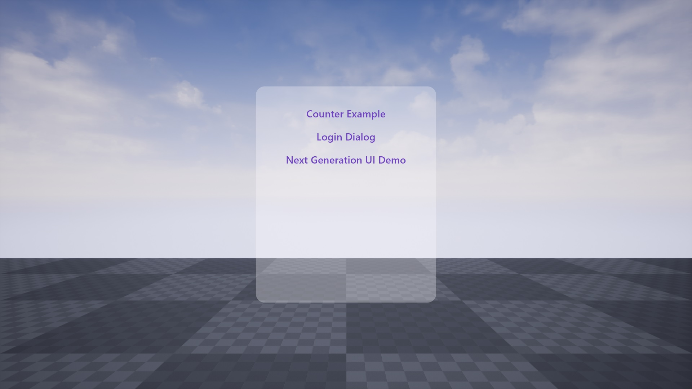
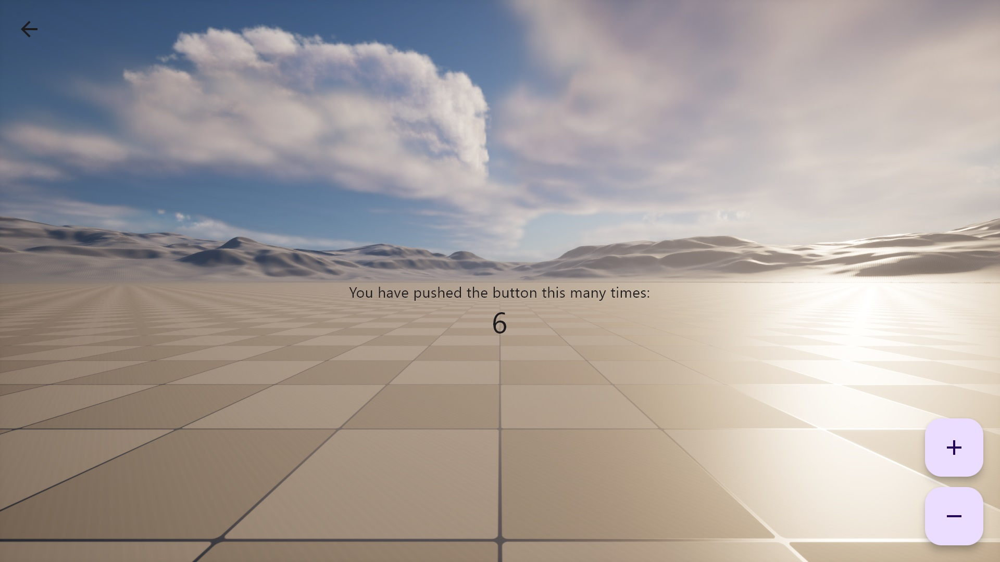
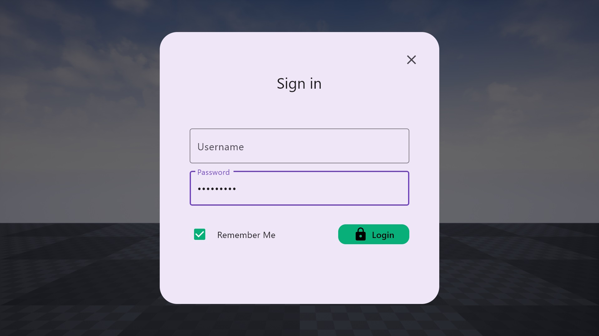
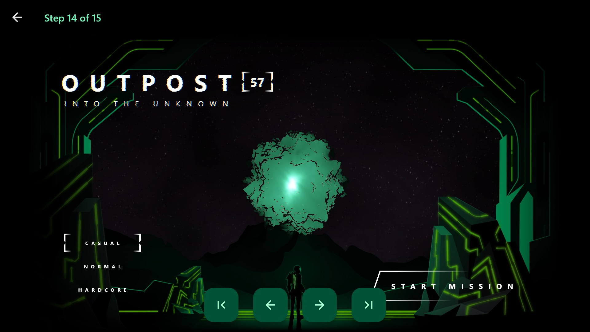

# FlutterUneal
Flutter + Unreal, Integrate Flutter into Unreal Engine

Build Unreal game UI with Dart, Lua or Typescipt

Supports D3D11 and Vulkan on Windows; Android and iOS are in the works.









## Dart example
```dart title=main.dart
//main.dart
import 'package:flutter/material.dart';

void main() {
  runApp(const MyApp());
}

class MyApp extends StatelessWidget {
  const MyApp({super.key});

  @override
  Widget build(BuildContext context) {
    return MaterialApp(
      title: 'Dart example',
      theme: ThemeData(
        useMaterial3: true,
        colorScheme: ColorScheme.fromSeed(seedColor: Colors.deepOrange),
      ),
      home: const Center(
        child: Text("FlutterUnreal Dart example")
      ),
    );
  }
}
```

## Lua example
```lua title=main.lua
--main.lua
local widget = Center {
  child = Text(
      "flutter_main", {
          style = TextStyle {
              fontWeight = FontWeight.bold,
              color = Colors.blue,
          },
          textDirection = TextDirection.ltr,
      }
  )
}

runApp(widget)
```

## Typescript example
```typescript title=flutter_main.ts
//flutter_main.ts
namespace flutter {
    function homePage() {
        let pressCount = 0
        return Builder({
            builder(context): Widget {
                let widget: Widget
                let theme = Theme.of(context)
                let colorScheme = theme.colorScheme
                let textTheme = theme.textTheme

                widget = Scaffold({
                    appBar: AppBar({
                        title: Text("Typescript Flutter Demo Home Page"),
                        backgroundColor: colorScheme.inversePrimary
                    }),
                    
                    body: Center ({
                        child: Column({
                            mainAxisAlignment: MainAxisAlignment.center,
                            children: [
                                Text('You have pushed the button this many times:'),
                                Text(`${pressCount}`, {
                                    style: textTheme.headlineMedium
                                }),
                            ]
                        })
                    }),

                    floatingActionButton: Column({
                        mainAxisSize: MainAxisSize.min,
                        children: [
                            FloatingActionButton({
                                onPressed() {
                                    pressCount += 1
                                    markNeedsBuild(context)
                                },
                                tooltip: 'Increment',
                                child: Icon(Icons.add),
                            }),

                            SizedBox({height: 20}),

                            FloatingActionButton({
                                onPressed() {
                                    pressCount -= 1
                                    markNeedsBuild(context)
                                },
                                tooltip: 'Decrement',
                                child: Icon(Icons.remove),
                            }),
                        ]
                    })
                })

                return widget
            }
        })
    }

    export function main() {
        let widget: Widget 
        widget = Builder({
            builder(context) {
                return MaterialApp({
                    title: "Flutter Demo",
                    theme: ThemeData({
                        colorSchemeSeed: Colors.deepPurple, 
                        useMaterial3: true,
                    }),
                    debugShowCheckedModeBanner: false,
                    navigatorKey: NavigationService.navigatorKey,
                    home: homePage()
                })
            }
        })
        
        runApp(widget)
    }
}

flutter.main()
```
